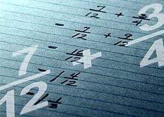

<!-- section start -->

<!-- attr: {id: 'title', class: 'slide-title', hasScriptWrapper: true} -->

#   Data Types and Variables
##    Numbers, strings and stuff

    
C++ Fundamentals

    
Telerik Algo Academy

    <a href="http://academy.telerik.com" class="signature-link">http://academy.telerik.com</a>

<!-- section start -->
<!-- attr: {id: 'table-of-contents'} -->
#   Table of Contents

*   Logical operators
    *   `||`, `&&`, `!`
*   Comparison operators
    *   `>`, `>=`, `<`, `<=`, `==`, `!=`
*   Bitwise operators
    *   `|`, `&`, `~`, `^`, `<<`, `>>`
*   Other operators
    *   Arithmetic operators
    *   Assignment operators
*   Operator priority

<!-- section start -->

<!-- attr: {class: 'slide-section', id: 'operators'} -->
#   Operators in C++
##    Arithmetic, Logical, Comparison, Assignment, etc...

#   What is an Operator?

*   Operator is an operation performed over data at runtime
    *   Takes on or more arguments (operands)
    *   Produces a new value
*   Operators have precedence
    *   Precedence defines which operation will be evaluated first
*   Expressions are sequences of operators and operands that are evaluated to a single value

#   Operators in C++

*   Operators in C++
    *   **Unary** operators - take one operand
    *   **Binary** operators- take two operands
    *   The **Ternary** operator (`?:`) - takes three operands
*   Except for the assignment operators, all binary operators are left-associative
*   The assignment operators and the ternary operator (?:) are right-associative

<!-- attr: {style: 'font-size:42px'} -->
#   Categories of Operators in C++

| Category             | Operators                 |
| -------------------- | ------------------------- |
| Arithmetic           | `+ - * / % ++ --`         |
| Logical              | `&& ^ !`                  |
| Binary               | `& ^ ~ << >>`             |
| Comparison           | `== != < > <= >=`         |
| Assignment           | `= += -= *= /= &= ^= >>=` |
| String concat        | `+`                       |
| Other                | `. [] () ?: new`          |

<!-- section start -->

<!-- attr: {class: 'slide-section', id: 'arithmetic-operators', hasScriptWrapper: true} -->
#   Arithmetic Operators <!-- .element: style="margin-top: 90px" -->

<!-- section start -->

<!-- attr: {class: 'slide-questions', id:"questions"} -->
#   Data Types and Variables
##    Questions
