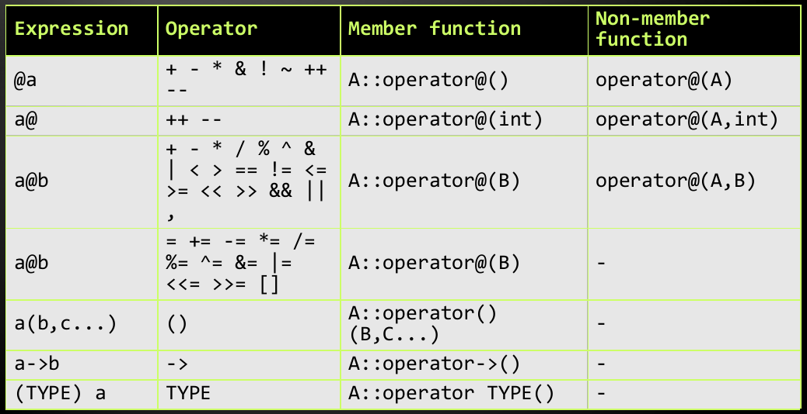

<!-- section start -->
<!-- attr: { id:'title', class:'slide-title', hasScriptWrapper:true } -->
# C++ Classes
## Definition, Constructors, Methods, Access Modifiers, Static/Instance members,

<div class="signature">
    <p class="signature-course">C++ Fundamentals</p>
    <p class="signature-initiative">Telerik Software Academy</p>
    <a href="http://academy.telerik.com" class="signature-link">http://academy.telerik.com</a>
</div>

<!-- section start -->
<!-- attr: {} -->
# Table of Contents
- Classes and Objects Concept
- Defining and Instantiating Classes
- Constructors, Initialization &amp; `this` keyword
  - Destructors
- Methods
- Operator Overloading
- Static and Instance Members
- Classes and `const`
- Pointers to classes

<!-- section start -->
<!-- attr: { class:'slide-section' } -->
# Classes and Objects in Programming
## Modelling the Real World in Code

<!-- attr: {} -->
# Classes and Objects Concept
- `Classes` model real-world objects and define
  - `Attributes` (state, properties, fields)
  - `Behavior` (methods, operations)
- Classes describe the structure of objects
  - Objects describe particular instance of a class
- Properties hold information about the modeled object relevant to the problem
- Operations implement object behavior

<!-- attr: {} -->
# Classes and Objects in C++
- Classes in C++ can have `members`:
  - Fields, constants, methods, operators, constructors, destructors, …
  - Inner types (inner classes, structures)
- Access modifiers define the scope of sets of members (scope)
  - `public`, `private`, `protected`
- Members can be
  - `static` (class) or `specific` for a given object

<!-- attr: {} -->
# Class Definition Example
- Defining a simple class to represent a Jedi

```cpp
class Jedi
{
public:
    string name;
    int forceMastery;

    Jedi(string name, int forceMastery)
    {
        this-&gt;name = name;
        this-&gt;forceMastery = forceMastery;
    }

    string getName()
    {
        return this-&gt;name;
    }

    void Speak()
    {
        string sentence = "Greetings, I am ";
        switch(this-&gt;forceMastery)
        {
        case 0:
            sentence+="padawan";
            break;
        case 1:
            sentence+="jedi-knight";
            break;
        case 2:
            sentence+="master";
        }
        sentence += " ";
        cout&lt;&lt;sentence + this-&gt;name&lt;&lt;endl;
    }
};
```
<!-- TODO: make it scrollable -->

<!-- attr: { class:'slide-section demo' } -->
# Simple Class Definition
## Live Demo

<!-- section start -->
<!-- attr: { class:'slide-section' } -->
# Defining Classes in C++
## Syntax, Keywords, Basic Members

<!-- attr: { hasScriptWrapper:true } -->
# Defining Classes in C++
- Classes are either defined with the `class` or `struct` keyword
  - Both syntaxes are **almost** the same
- Class definition is in the form:

```cpp
class ClassName : InheritedClass1, ...
{
access-modifier : // e.g. public:
    members       // e.g. int a;
				  // or int answer(){return 42;}
access-modifier :
    members
...
};
```

<div class="balloon" style="top:84%; left:10%">
Don't forget the semicolon after definition
</div>

<!-- attr: {} -->
# Defining Classes in C++
- A class has a name
- A class can "inherit" other classes
  - i.e. reuse their logic and members
- A class declares accessibility of its members
  - Which members are visible from outside
  - Which members are visible from inheritors
  - Which members are only visible from inside
  - These are known as "access modifiers" or "scopes"

<!-- attr: { hasScriptWrapper:true } -->
# Defining Classes in C++
- Access modifiers in classes
  - `public`: accessible from <span style="color:red">anywhere outside or inside the class and its inheritors</span>
  - `protected`: accessible from <span style="color:yellow">inside the class and from its inheritors</span>
  - `private`: accessible <span style="color:green">only from inside the class</span>
- If not specified, members of a `class` are <span style="color:red">private</span>
  - If not specified, members of a `struct` are <span style="color:green">public</span>

<!-- An access modifier affects all members, declared after it up to the next modifier (or up to the end of the class definition) -->

<!-- attr: {} -->
# Defining Classes in C++
- Fields are the simplest members of classes
  - Fields are variables inside the class
  - Can be of any type, including other classes, or even of the same class
    - The latter case is usually called a recursive class
  - Can be initialized on declaration (C++11)
    - Keep in mind they can be changed by the constructor or other methods

```cpp
class Person {
public:
    string name;
	int age = 0;
};
```

<!-- attr: {} -->
# Defining Classes in C++
- Creating objects of classes
  - Usually to use a class, you instantiate an object of that class
    - E.g. you instantiate a individual of type Person
```cpp
Person somebody;
```
    - "instantiate": we create an instance
	  - not "initialized"
- Accessing object members
  - Members are accessed through the `.` operator
```cpp
somebody.name = "Waspy";
cout << somebody.name;
```

<!-- attr: { class:'slide-section demo' } -->
# Creating Classes &amp; Instantiating Objects
## Live Demo

<!-- section start -->
<!-- attr: { class:'slide-section' } -->
# Constructors
## Initializing Objects, Calling Constructors

<!-- attr: {} -->
# Constructors
- Objects need to be initialized before usage
  - If not, we could get undetermined results
  - Just like with uninitialized variables
- Objects usually can't be initialized by literal:
  - E.g. can't initializea Person with just a name, or just a number, it needs both to set its age and name
    - Some classes need even more values

    - Some classes need complex initialization logic

```cpp
Person somebody = "Tony";
Person somebody = 5;
//both of the above are wrong
```

<!-- attr: {} -->
# Constructors
- Constructors are special functions, responsible for initializing objects
  - Declared inside the class
  - Have same name as the class
  - Accept parameters like normal functions
  - Can be overloaded like normal functions
  - Have direct access to the class members
  - Don't have a return type
  - Execute after inline initialization
    - i.e. if a field has a value at declaration, the constructor can change it

<!-- attr: {} -->
# Constructors
- Constructor for the Person class

```cpp
class Person
{
public:
    string name;
    int age = 0;

    Person(string nameParameter, int ageParameter)
    {
        name = nameParameter;
        age = ageParameter;
				// changes the 0 value of age
    }
};
```

<!-- attr: {} -->
# Constructors
- Constructors can be called in several ways
  - Parenthesis after identifier, at declaration
  - Class name, followed by parenthesis
    - i.e. create a temporary &amp; assign it to an instance
```cpp
Person p("Tony", 22);
Person p = Person("Tony", 22);
```
  - Same as above, but with "new"
    - Allocates dynamic memory for objects
    - Returns a pointer to the memory
```cpp
Person *p = new Person("Tony", 22);
```

<!-- attr: { class:'slide-section demo' } -->
# Basic Constructors
## Live Demo

<!-- attr: { hasScriptWrapper:true } -->
# Constructors
- Mistaken constructor (ambiguous identifiers)
  - `name` and `age` here hide the class fields
    - Function variables and parameters are "more local" than global or class variables

```cpp
class Person
{
public:
    string name;
    int age;

    Person(string name, int age)
    {
        name = name;
        age = age;
    }
};
```

<div class="balloon" style="top:80%;left:42%">
These assignments do nothing – they set the parameters to their own values
</div>

<!-- attr: { style:'font-size:40px' } -->
# Constructors &amp; this
- The `this` keyword
  - Explicitly refers to the current class instance
  - Used to explicitly point to a instance member
    - Even if it is hidden by local variables

```cpp
class Person
{
public:
    string name;
    int age;

    Person(string name, int age)
    {
        this->name = name;
        this->age = age;
    }
};
```

<!-- attr: { hasScriptWrapper:true } -->
# Constructors &amp; this
- More info on the `this` keyword
  - Typed pointer to current instance
    - E.g. for a `Person` instance named `p`, `this` could be expressed as: `Person* this = &p;`
  - Can be used in any constructor
    - or function (method) inside the class
  - Recommended way of accessing instance members

<div class="balloon" style="top:36%;left:78%">
don't try to compile that
<div>

<!-- attr: { class:'slide-section demo' } -->
# Using "this" in Constructors
## Live Demo

<!-- attr: { style:'font-size:40px' } -->
# Overloading Constructors
- Constructors can be overloaded

```cpp
class Person {
public:
    string name;
    int age;

    Person(string name, int age)
    {
        this->name = name;
        this->age = age;
    }

	// format: "022Tony"-> Tony, age 22
    Person(string personInfo)
    {
        this->age = 100 * (personInfo[0] - '0') +
                    10 * (personInfo[1] - '0') +
                    personInfo[2] - '0';
        this->name = personInfo.substr(3);
    }
};
```

<!-- attr: { style:'font-size:40px' } -->
# Overloading Constructors
- Constructor parameters can have default values, just like functions

```cpp
class Person
{
public:
    string name;
    int age;

    Person(string name = "Anonymous", int age = 0)
    {
        this->name = name;
        this->age = age;
    }
};
```

<!-- attr: { class:'slide-section demo'} -->
# Constructor Overloading
## Live Demo

<!-- attr: { style:'font-size:40px' } -->
# Destructors
- Destructors are special functions, called when an object is freed from memory
- A destructor is usually responsible for:
  - Cleaning up allocated dynamic memory by the instance
  - Resetting any changes a constructor could have made outside the instance
- Syntax: same as constructor, with a `~` prefix and no parameters

```cpp
~Person(){ ... }
```

<!-- attr: { class:'slide-section demo' } -->
# Destructors
## Live Demo

<!-- section start -->
<!-- attr: { class:'slide-section' } -->
# Methods
## Functions in Classes

<!-- attr: {} -->
# Methods
- Methods are functions, belonging to a class
- Methods have all the properties of functions
  - Can accept parameters and be overloaded
  - Can have default values for parameters
  - Have return values
- Methods have access to other class members
  - Recommended to use the `this` pointer
- Methods can be accessed through any instance through the `.` operator

<!-- attr: { style:'font-size:40px' } -->
# Methods

```cpp
class Person
{
public:
    string name;
    int age;

    Person(string name, int age)
    {
        this->name = name;
        this->age = age;
    }

    string GetInfo()
    {
        stringstream infoStream;
        infoStream << this->name
			<< ", age: " << this->age << endl;
        return infoStream.str();
    }
};
```

<!-- attr: { class:'slide-section demo' } -->
# Methods
## Live Demo

<!-- section start -->
<!-- attr: { class:'slide-section' } -->
# Operator Overloading
## Redefining basic operations for complex classes

<!-- attr: {} -->
# Operator Overloading
- Classes define new types in C++
  - Types interact with assignments, function calls and operators
- Instances of a new class can also use operators
  - By defining how operators work on its instances
  - This is called operator overloading
- Syntax

```cpp
type operator sign (parameters) { /*... body ...*/ } 
```

<!-- attr: { style:'font-size:40px' } -->
# Operator Overloading
- Example overloading + for 2D vectors

```cpp
class Vector2D
{
public:
    double x;
    double y;

    Vector2D(double x = 0, double y = 0)
    {
        this->x = x;
        this->y = y;
    }

    Vector2D operator + (const Vector2D &other)
    {
        return Vector2D(this->x + other.x,
                        this->y + other.y);
    }
};
```

<!-- attr: { class:'slide-section demo' } -->
# Basic Operator Overloading
## Live Demo

<!-- attr: {} -->
# Operator Overloading
- Overloaded operators are just special functions
  - Using operators is just calling those functions
- Operators can be overloaded both as members and as non-members
  - Members can access the calling object through the `this` pointer
  - Non-members take an additional parameter to refer to the object, calling the operator

<!-- attr: { style:'font-size:35px',hasScriptWrapper:true } -->
# Operator Overloading
- Form of common overloaded operators:



<!-- attr: { class:'slide-section demo' } -->
# Overloading Operators as Members an Non-Members
## Live Demo

<!-- attr: {} -->
# Operator Overloading
- Calling operators can be done in two ways
  - As normal operators in expressions
  - By their function name i.e.:
  - prefixed with operator keyword,
    - followed by the actual operator
    - and its parameters in parantheses

```cpp
c = a + b;
c = a.operator+ (b);
```

<!-- section start -->
<!-- attr: { class:'slide-section demo' } -->
# Static Members
## Members Common for all Instances

<!-- attr: {} -->
# Static Members
- There is data (and behavior) which can be the same for all instances of a class
  - E.g. average person age – doesn't need to be specific for each instance
- Static members
  - Single common variables for objects of a class
  - Marked by the `static` keyword
  - Must be initialized from outside the class
    - To avoid reinitialization

<!-- attr: { style:'font-size:40px', hasScriptWrapper:true } -->
# Static Members
- Example: Person static members

<pre style="overflow:auto;height:50%">
<code style="height:90%">class Person
{
private:
    static int personCount;
    static int totalPersonAge;

public:
    string name;
    int age;

    Person(string name = "", int age = 0)
    {
        this-&gt;name = name;
        this-&gt;age = age;

        Person::totalPersonAge += this-&gt;age;
        Person::personCount++;
    }

    ~Person()
    {
        Person::totalPersonAge -= this-&gt;age;
        Person::personCount--;
    }

    static int getAveragePersonAge()
    {
        return Person::totalPersonAge
			/ Person::personCount;
    }
};</code></pre>

- Two ways of accessing static members:
  - Through class name, followed by ::
  - Through instance, like any other member

<!-- attr: { class:'slide-section demo' } -->
# Static Members
## Live Demo

<!-- section start -->
<!-- attr: { class:'slide-section' } -->
# Classes and const
## Restricting Modifications Compile-Time

<!-- attr: { style:'font-size:40px' } -->
# Classes and const
- Class members can be defined `const`
  - Fields follow the same rules as `const` variables
  - Methods and operators cannot modify the instance they are called on
    - Syntax: place `const` after method parentheses

```cpp
class Person {
    ...
    string getInfo() const
    {
        stringstream infoStream;
        infoStream << this->name <<", age: "
			<< this->age << endl;
        return infoStream.str();
    }
};
```

<!-- attr: {} -->
# Classes and const
- `const` methods are frequently used
  - Mark a non-modifying method
  - Hence, required by many standard library methods, accepting references
  - A `const` reference to an object can only call `const` methods
- An object can be `const` like any variable
  - Only consturctor & `const` methods can be called

```cpp
const Person p = Person("Tony", 20);
cout << p.getPersonInfo() << endl;
```

<!-- attr: { class:'slide-section demo' } -->
# Classes and const
## Live Demo

<!-- section start -->
<!-- attr: { class:'slide-section' } -->
# Pointers to Classes
## Instances in Dynamic Memory

<!-- attr: { style:'font-size:40px' } -->
# Pointers to Classes
- As mentioned, creating an instance with the `new` keyword returns a pointer
- A pointer can also be obtained by using the reference operator `&`
```cpp
Person *samPtr = new Person("Sam", 18);
Person frodo = Person("Frodo", 18);
Person *frodoPtr = &frodo;
```
- All typical pointer operations are valid
- Access to members is done through the `->` operator
```cpp
cout << samPtr->getPersonInfo() << endl;
```

<!-- attr: { class:'slide-section demo' } -->
# Pointers to Classes
## Live Demo

<!-- section start -->
<!-- attr: { class:'slide-questions' } -->
# C++ Classes
## Questions
